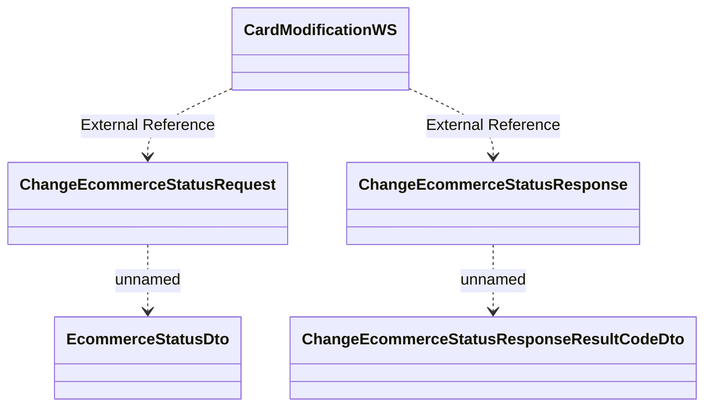

# CardModificationWS.ChangeEcommerceStatus

- **Diagram Type**: Logical
- **Package**: HomerSelect/BSL/Analysis Model/_Interface/Consumed services/Card Management System/CardModificationWS/CardModificationWS_v1
- **Diagram ID**: 135374
- **Elements**: 5
- **Connectors**: 4

