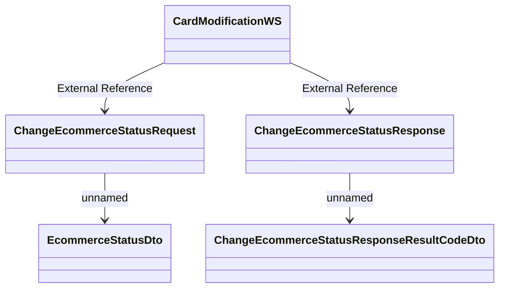

# CardModificationWS.ChangeEcommerceStatus

```mermaid
classDiagram
    class ChangeEcommerceStatusResponseResultCodeDto["ChangeEcommerceStatusResponseResultCodeDto"]
    class EcommerceStatusDto["EcommerceStatusDto"]
    class ChangeEcommerceStatusResponse["ChangeEcommerceStatusResponse"]
    class ChangeEcommerceStatusRequest["ChangeEcommerceStatusRequest"]
    class CardModificationWS["CardModificationWS"]
    CardModificationWS --> ChangeEcommerceStatusRequest : External Reference
    CardModificationWS --> ChangeEcommerceStatusResponse : External Reference
    ChangeEcommerceStatusRequest --> EcommerceStatusDto : unnamed
    ChangeEcommerceStatusResponse --> ChangeEcommerceStatusResponseResultCodeDto : unnamed
```
