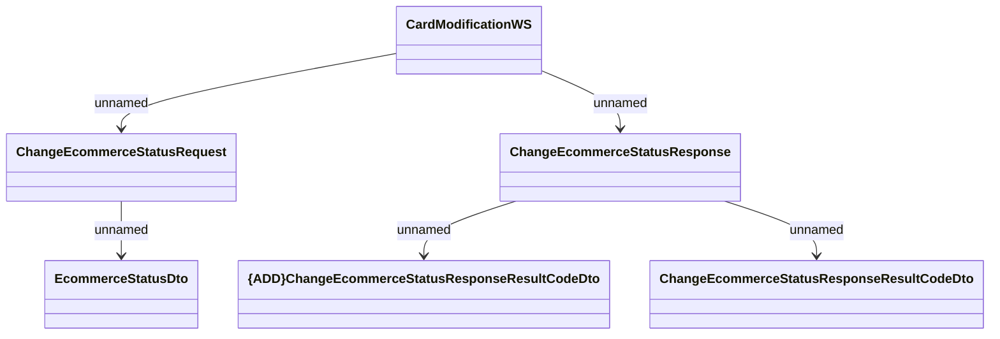

# CardModificationWS.ChangeEcommerceStatus

```mermaid
classDiagram
    class ChangeEcommerceStatusResponseResultCodeDto["ChangeEcommerceStatusResponseResultCodeDto"]
    class EcommerceStatusDto["EcommerceStatusDto"]
    class ADD_ChangeEcommerceStatusResponseResultCodeDto["{ADD}ChangeEcommerceStatusResponseResultCodeDto"]
    class ChangeEcommerceStatusResponse["ChangeEcommerceStatusResponse"]
    class ChangeEcommerceStatusRequest["ChangeEcommerceStatusRequest"]
    class CardModificationWS["CardModificationWS"]
    CardModificationWS --> ChangeEcommerceStatusRequest : unnamed
    CardModificationWS --> ChangeEcommerceStatusResponse : unnamed
    ChangeEcommerceStatusResponse --> ADD_ChangeEcommerceStatusResponseResultCodeDto : unnamed
    ChangeEcommerceStatusRequest --> EcommerceStatusDto : unnamed
    ChangeEcommerceStatusResponse --> ChangeEcommerceStatusResponseResultCodeDto : unnamed
```
