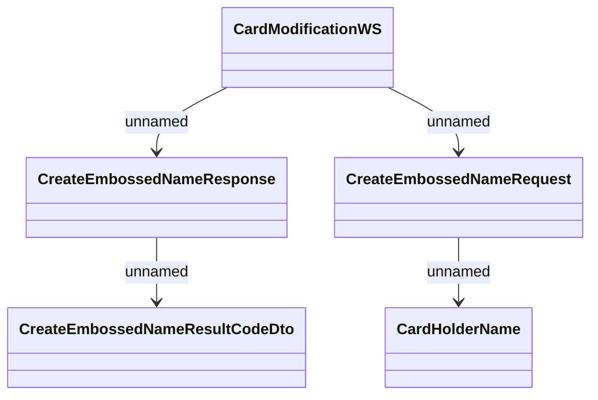

# CardModificationWS.CreateEmbossedName

```mermaid
classDiagram
    class CardHolderName["CardHolderName"]
    class CreateEmbossedNameRequest["CreateEmbossedNameRequest"]
    class CreateEmbossedNameResponse["CreateEmbossedNameResponse"]
    class CreateEmbossedNameResultCodeDto["CreateEmbossedNameResultCodeDto"]
    class CardModificationWS["CardModificationWS"]
    CreateEmbossedNameResponse --> CreateEmbossedNameResultCodeDto : unnamed
    CardModificationWS --> CreateEmbossedNameResponse : unnamed
    CardModificationWS --> CreateEmbossedNameRequest : unnamed
    CreateEmbossedNameRequest --> CardHolderName : unnamed
```
