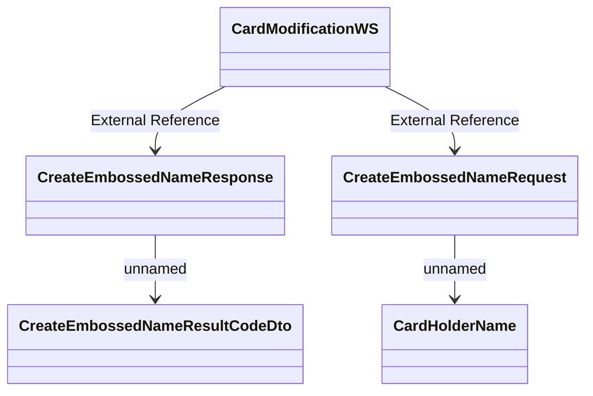

# CardModificationWS.CreateEmbossedName

```mermaid
classDiagram
    class CardHolderName["CardHolderName"]
    class CreateEmbossedNameRequest["CreateEmbossedNameRequest"]
    class CreateEmbossedNameResponse["CreateEmbossedNameResponse"]
    class CreateEmbossedNameResultCodeDto["CreateEmbossedNameResultCodeDto"]
    class CardModificationWS["CardModificationWS"]
    CardModificationWS --> CreateEmbossedNameResponse : External Reference
    CardModificationWS --> CreateEmbossedNameRequest : External Reference
    CreateEmbossedNameRequest --> CardHolderName : unnamed
    CreateEmbossedNameResponse --> CreateEmbossedNameResultCodeDto : unnamed
```
