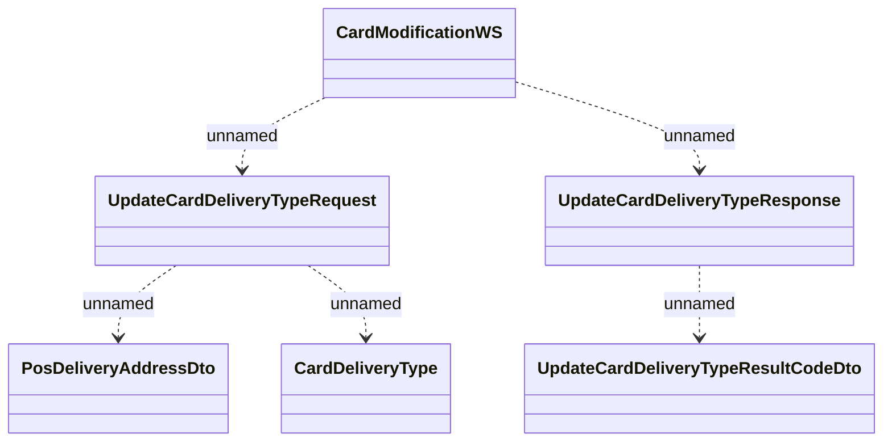

# CardModificationWS.UpdateCardDeliveryType

- **Diagram Type**: Logical
- **Package**: HomerSelect/BSL/Analysis Model/_Interface/Consumed services/Card Management System/CardModificationWS/CardModificationWS_v2
- **Diagram ID**: 135391
- **Elements**: 6
- **Connectors**: 5

