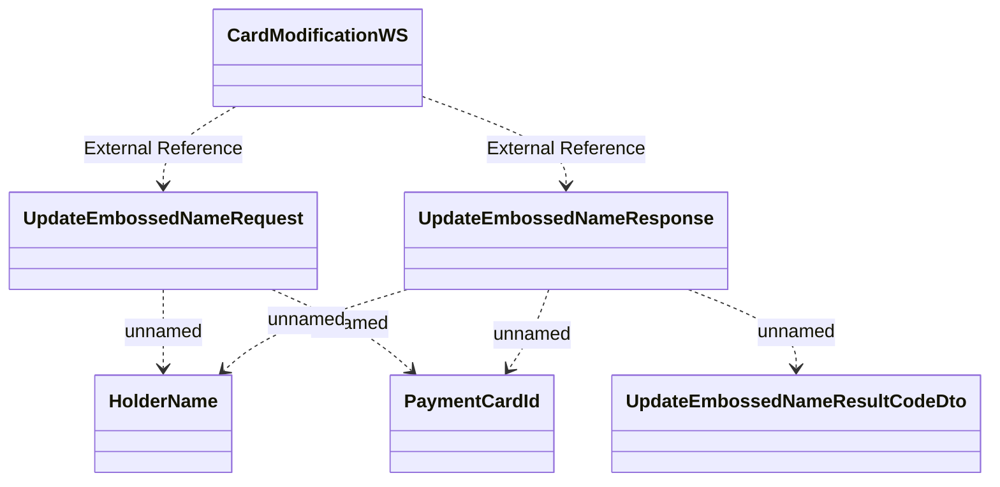

# CardModificationWS.UpdateEmbossedName

- **Diagram Type**: Logical
- **Package**: HomerSelect/BSL/Analysis Model/_Interface/Consumed services/Card Management System/CardModificationWS/CardModificationWS_v1
- **Diagram ID**: 135370
- **Elements**: 6
- **Connectors**: 7

