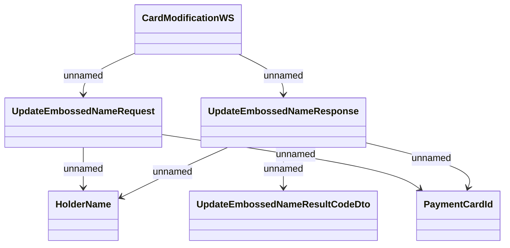

# CardModificationWS.UpdateEmbossedName

```mermaid
classDiagram
    class PaymentCardId["PaymentCardId"]
    class HolderName["HolderName"]
    class UpdateEmbossedNameResultCodeDto["UpdateEmbossedNameResultCodeDto"]
    class UpdateEmbossedNameResponse["UpdateEmbossedNameResponse"]
    class UpdateEmbossedNameRequest["UpdateEmbossedNameRequest"]
    class CardModificationWS["CardModificationWS"]
    CardModificationWS --> UpdateEmbossedNameRequest : unnamed
    CardModificationWS --> UpdateEmbossedNameResponse : unnamed
    UpdateEmbossedNameResponse --> UpdateEmbossedNameResultCodeDto : unnamed
    UpdateEmbossedNameResponse --> HolderName : unnamed
    UpdateEmbossedNameRequest --> HolderName : unnamed
    UpdateEmbossedNameResponse --> PaymentCardId : unnamed
    UpdateEmbossedNameRequest --> PaymentCardId : unnamed
```
