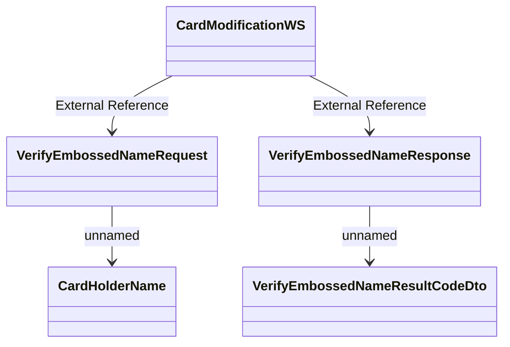

# CardModificationWS.VerifyEmbossedName

```mermaid
classDiagram
    class VerifyEmbossedNameResultCodeDto["VerifyEmbossedNameResultCodeDto"]
    class CardHolderName["CardHolderName"]
    class VerifyEmbossedNameResponse["VerifyEmbossedNameResponse"]
    class VerifyEmbossedNameRequest["VerifyEmbossedNameRequest"]
    class CardModificationWS["CardModificationWS"]
    CardModificationWS --> VerifyEmbossedNameRequest : External Reference
    CardModificationWS --> VerifyEmbossedNameResponse : External Reference
    VerifyEmbossedNameRequest --> CardHolderName : unnamed
    VerifyEmbossedNameResponse --> VerifyEmbossedNameResultCodeDto : unnamed
```
