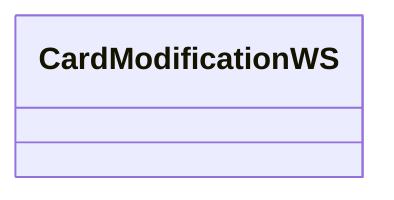

# CardModificationWS

- **Diagram Type**: Logical
- **Package**: HomerSelect/BSL/Analysis Model/_Interface/Consumed services/Card Management System/CardModificationWS/CardModificationWS_v2
- **Diagram ID**: 135387
- **Elements**: 1
- **Connectors**: 0

