# CardOriginationWS  - messages

- **Diagram Type**: Logical
- **Package**: HomerSelect/BSL/Analysis Model/_Interface/Consumed services/Card Management System/CardOriginationWS/CardOriginationWS_v3/Messages
- **Diagram ID**: 135421
- **Elements**: 13
- **Connectors**: 6

```mermaid
classDiagram
    class ReserveCardResultCodeDto["ReserveCardResultCodeDto"]
    class ReserveInstantCardResponse["ReserveInstantCardResponse"]
    class ReserveInstantCardRequest["ReserveInstantCardRequest"]
    class ConfirmInstantCardResultCodeDto["ConfirmInstantCardResultCodeDto"]
    class CreatePersonalizedCardResultCodeDto["CreatePersonalizedCardResultCodeDto"]
    class CreatePersonalizedCardResponse["CreatePersonalizedCardResponse"]
    class CardDeliveryType["CardDeliveryType"]
    class CreatePersonalizedCardRequest["CreatePersonalizedCardRequest"]
    class ConfirmPersonalizedCardResultCodeDto["ConfirmPersonalizedCardResultCodeDto"]
    class ConfirmPersonalizedCardResponse["ConfirmPersonalizedCardResponse"]
    class ConfirmPersonalizedCardRequest["ConfirmPersonalizedCardRequest"]
    class ConfirmInstantCardResponse["ConfirmInstantCardResponse"]
    class ConfirmInstantCardRequest["ConfirmInstantCardRequest"]
    ConfirmPersonalizedCardResponse ..> ConfirmPersonalizedCardResultCodeDto : unnamed
    ConfirmInstantCardRequest ..> CardDeliveryType : unnamed
    CreatePersonalizedCardRequest ..> CardDeliveryType : unnamed
    CreatePersonalizedCardResponse ..> CreatePersonalizedCardResultCodeDto : unnamed
    ConfirmInstantCardResponse ..> ConfirmInstantCardResultCodeDto : unnamed
    ReserveInstantCardResponse ..> ReserveCardResultCodeDto : unnamed
```

