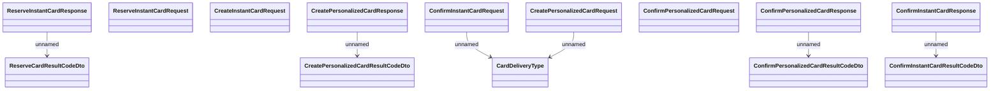

# CardOriginationWS  - messages

```mermaid
classDiagram
    class ReserveCardResultCodeDto["ReserveCardResultCodeDto"]
    class ReserveInstantCardResponse["ReserveInstantCardResponse"]
    class ReserveInstantCardRequest["ReserveInstantCardRequest"]
    class ConfirmInstantCardResultCodeDto["ConfirmInstantCardResultCodeDto"]
    class CreateInstantCardRequest["CreateInstantCardRequest"]
    class CreatePersonalizedCardResultCodeDto["CreatePersonalizedCardResultCodeDto"]
    class CreatePersonalizedCardResponse["CreatePersonalizedCardResponse"]
    class CardDeliveryType["CardDeliveryType"]
    class CreatePersonalizedCardRequest["CreatePersonalizedCardRequest"]
    class ConfirmPersonalizedCardResultCodeDto["ConfirmPersonalizedCardResultCodeDto"]
    class ConfirmPersonalizedCardResponse["ConfirmPersonalizedCardResponse"]
    class ConfirmPersonalizedCardRequest["ConfirmPersonalizedCardRequest"]
    class ConfirmInstantCardResponse["ConfirmInstantCardResponse"]
    class ConfirmInstantCardRequest["ConfirmInstantCardRequest"]
    ConfirmInstantCardRequest --> CardDeliveryType : unnamed
    ConfirmInstantCardResponse --> ConfirmInstantCardResultCodeDto : unnamed
    ConfirmPersonalizedCardResponse --> ConfirmPersonalizedCardResultCodeDto : unnamed
    CreatePersonalizedCardRequest --> CardDeliveryType : unnamed
    CreatePersonalizedCardResponse --> CreatePersonalizedCardResultCodeDto : unnamed
    ReserveInstantCardResponse --> ReserveCardResultCodeDto : unnamed
```
