# CardOriginationWS - types

- **Diagram Type**: Logical
- **Package**: HomerSelect/BSL/Analysis Model/_Interface/Consumed services/Card Management System/CardOriginationWS/CardOriginationWS_v3/Types
- **Diagram ID**: 135422
- **Elements**: 18
- **Connectors**: 13

```mermaid
classDiagram
    class Subdistrict["Subdistrict"]
    class TruncatedPan["TruncatedPan"]
    class CardHolderName["CardHolderName"]
    class Zip["Zip"]
    class Town["Town"]
    class Street["Street"]
    class SellerPlaceCode["SellerPlaceCode"]
    class Region["Region"]
    class HouseNumber["HouseNumber"]
    class FlatNumber["FlatNumber"]
    class District["District"]
    class BlockNumber["BlockNumber"]
    class PosDeliveryAddressDto["PosDeliveryAddressDto"]
    class AccountTypeDto["AccountTypeDto"]
    class ServiceCode["ServiceCode"]
    class CurrencyCodeType["CurrencyCodeType"]
    class ContractCode["ContractCode"]
    class AccountDto["AccountDto"]
    AccountDto ..> ContractCode : unnamed
    AccountDto ..> CurrencyCodeType : unnamed
    AccountDto ..> AccountTypeDto : unnamed
    PosDeliveryAddressDto ..> BlockNumber : unnamed
    PosDeliveryAddressDto ..> District : unnamed
    PosDeliveryAddressDto ..> FlatNumber : unnamed
    PosDeliveryAddressDto ..> HouseNumber : unnamed
    PosDeliveryAddressDto ..> Region : unnamed
    PosDeliveryAddressDto ..> SellerPlaceCode : unnamed
    PosDeliveryAddressDto ..> Street : unnamed
    PosDeliveryAddressDto ..> Town : unnamed
    PosDeliveryAddressDto ..> Zip : unnamed
    PosDeliveryAddressDto ..> Subdistrict : unnamed
```

