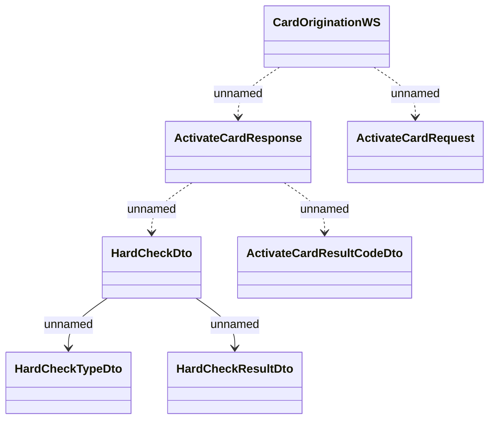

# CardOriginationWS.ActivateCard

- **Diagram Type**: Logical
- **Package**: HomerSelect/BSL/Analysis Model/_Interface/Consumed services/Card Management System/CardOriginationWS/CardOriginationWS_v2
- **Diagram ID**: 135408
- **Elements**: 7
- **Connectors**: 6

