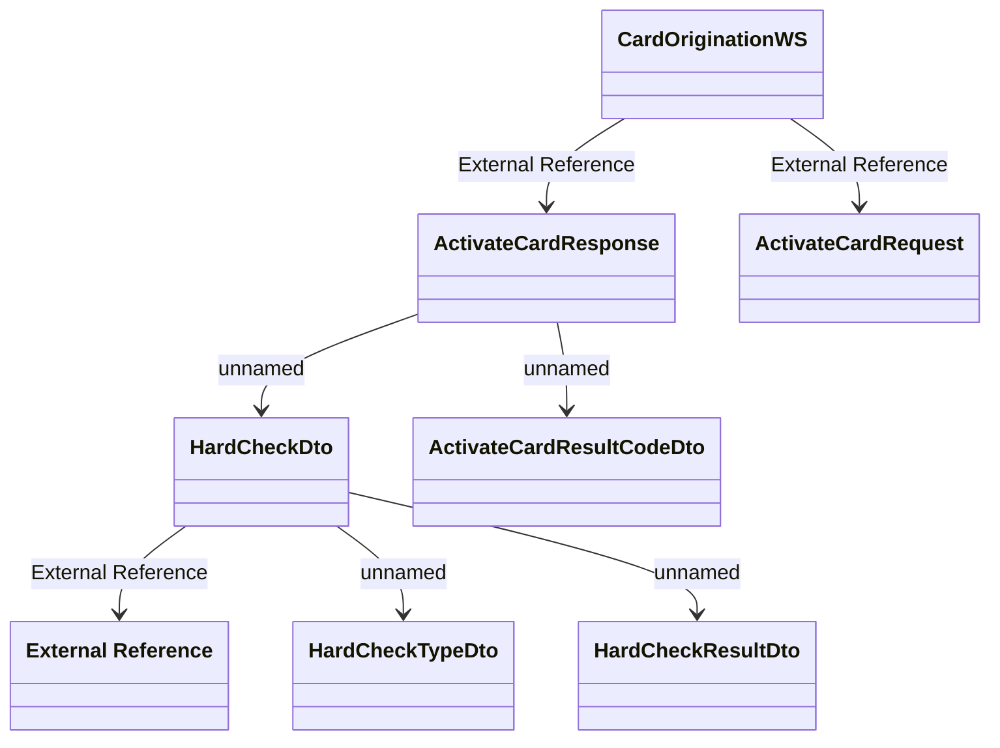

# CardOriginationWS.ActivateCard

```mermaid
classDiagram
    class HardCheckResultDto["HardCheckResultDto"]
    class External_Reference["External Reference"]
    class HardCheckTypeDto["HardCheckTypeDto"]
    class HardCheckDto["HardCheckDto"]
    class ActivateCardResultCodeDto["ActivateCardResultCodeDto"]
    class ActivateCardResponse["ActivateCardResponse"]
    class ActivateCardRequest["ActivateCardRequest"]
    class CardOriginationWS["CardOriginationWS"]
    CardOriginationWS --> ActivateCardRequest : External Reference
    CardOriginationWS --> ActivateCardResponse : External Reference
    HardCheckDto --> External_Reference : External Reference
    ActivateCardResponse --> HardCheckDto : unnamed
    ActivateCardResponse --> ActivateCardResultCodeDto : unnamed
    HardCheckDto --> HardCheckTypeDto : unnamed
    HardCheckDto --> HardCheckResultDto : unnamed
```
