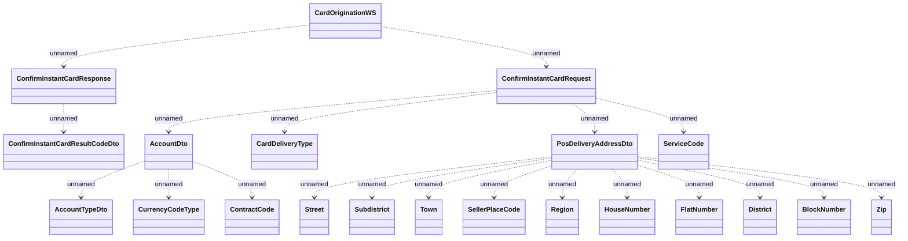

# CardOriginationWS.ConfirmInstantCard

- **Diagram Type**: Logical
- **Package**: HomerSelect/BSL/Analysis Model/_Interface/Consumed services/Card Management System/CardOriginationWS/CardOriginationWS_v3
- **Diagram ID**: 135416
- **Elements**: 21
- **Connectors**: 20

