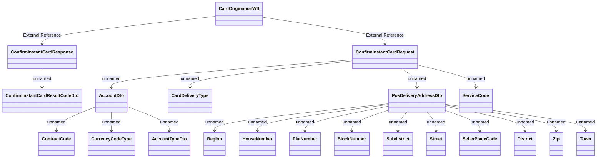

# CardOriginationWS.ConfirmInstantCard

```mermaid
classDiagram
    class Subdistrict["Subdistrict"]
    class ConfirmInstantCardResultCodeDto["ConfirmInstantCardResultCodeDto"]
    class ConfirmInstantCardResponse["ConfirmInstantCardResponse"]
    class AccountTypeDto["AccountTypeDto"]
    class CurrencyCodeType["CurrencyCodeType"]
    class ContractCode["ContractCode"]
    class AccountDto["AccountDto"]
    class CardDeliveryType["CardDeliveryType"]
    class Zip["Zip"]
    class Town["Town"]
    class Street["Street"]
    class SellerPlaceCode["SellerPlaceCode"]
    class Region["Region"]
    class PosDeliveryAddressDto["PosDeliveryAddressDto"]
    class HouseNumber["HouseNumber"]
    class FlatNumber["FlatNumber"]
    class District["District"]
    class BlockNumber["BlockNumber"]
    class ServiceCode["ServiceCode"]
    class ConfirmInstantCardRequest["ConfirmInstantCardRequest"]
    class CardOriginationWS["CardOriginationWS"]
    CardOriginationWS --> ConfirmInstantCardResponse : External Reference
    CardOriginationWS --> ConfirmInstantCardRequest : External Reference
    ConfirmInstantCardRequest --> CardDeliveryType : unnamed
    ConfirmInstantCardRequest --> ServiceCode : unnamed
    ConfirmInstantCardRequest --> AccountDto : unnamed
    ConfirmInstantCardRequest --> PosDeliveryAddressDto : unnamed
    ConfirmInstantCardResponse --> ConfirmInstantCardResultCodeDto : unnamed
    AccountDto --> ContractCode : unnamed
    AccountDto --> CurrencyCodeType : unnamed
    AccountDto --> AccountTypeDto : unnamed
    PosDeliveryAddressDto --> Region : unnamed
    PosDeliveryAddressDto --> HouseNumber : unnamed
    PosDeliveryAddressDto --> FlatNumber : unnamed
    PosDeliveryAddressDto --> BlockNumber : unnamed
    PosDeliveryAddressDto --> Subdistrict : unnamed
    PosDeliveryAddressDto --> Street : unnamed
    PosDeliveryAddressDto --> SellerPlaceCode : unnamed
    PosDeliveryAddressDto --> District : unnamed
    PosDeliveryAddressDto --> Zip : unnamed
    PosDeliveryAddressDto --> Town : unnamed
```
