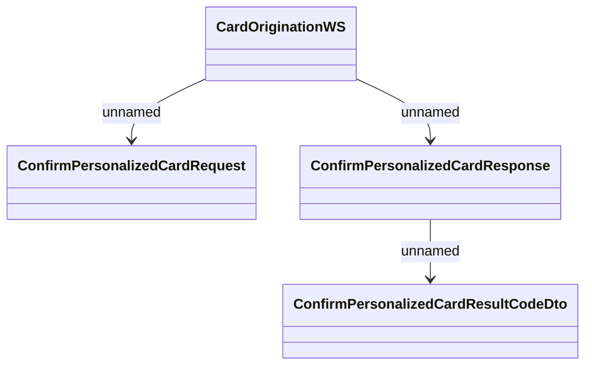

# CardOriginationWS.ConfirmPersonalizedCard

```mermaid
classDiagram
    class ConfirmPersonalizedCardRequest["ConfirmPersonalizedCardRequest"]
    class ConfirmPersonalizedCardResultCodeDto["ConfirmPersonalizedCardResultCodeDto"]
    class ConfirmPersonalizedCardResponse["ConfirmPersonalizedCardResponse"]
    class CardOriginationWS["CardOriginationWS"]
    CardOriginationWS --> ConfirmPersonalizedCardResponse : unnamed
    ConfirmPersonalizedCardResponse --> ConfirmPersonalizedCardResultCodeDto : unnamed
    CardOriginationWS --> ConfirmPersonalizedCardRequest : unnamed
```
