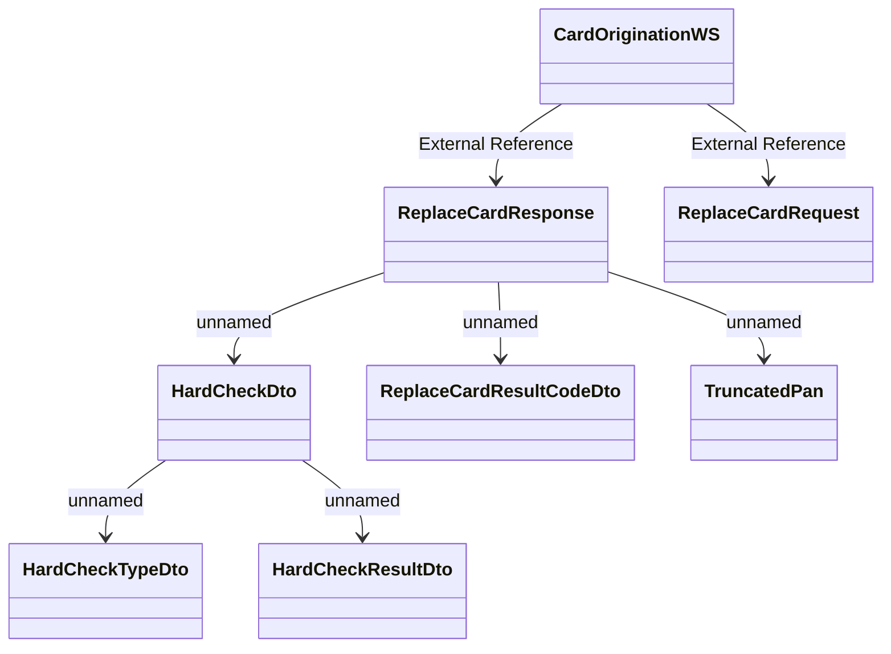

# CardOriginationWS.ReplaceCard

```mermaid
classDiagram
    class HardCheckTypeDto["HardCheckTypeDto"]
    class HardCheckDto["HardCheckDto"]
    class ReplaceCardResultCodeDto["ReplaceCardResultCodeDto"]
    class CardOriginationWS["CardOriginationWS"]
    class TruncatedPan["TruncatedPan"]
    class HardCheckResultDto["HardCheckResultDto"]
    class ReplaceCardResponse["ReplaceCardResponse"]
    class ReplaceCardRequest["ReplaceCardRequest"]
    CardOriginationWS --> ReplaceCardRequest : External Reference
    CardOriginationWS --> ReplaceCardResponse : External Reference
    ReplaceCardResponse --> ReplaceCardResultCodeDto : unnamed
    ReplaceCardResponse --> TruncatedPan : unnamed
    ReplaceCardResponse --> HardCheckDto : unnamed
    HardCheckDto --> HardCheckTypeDto : unnamed
    HardCheckDto --> HardCheckResultDto : unnamed
```
