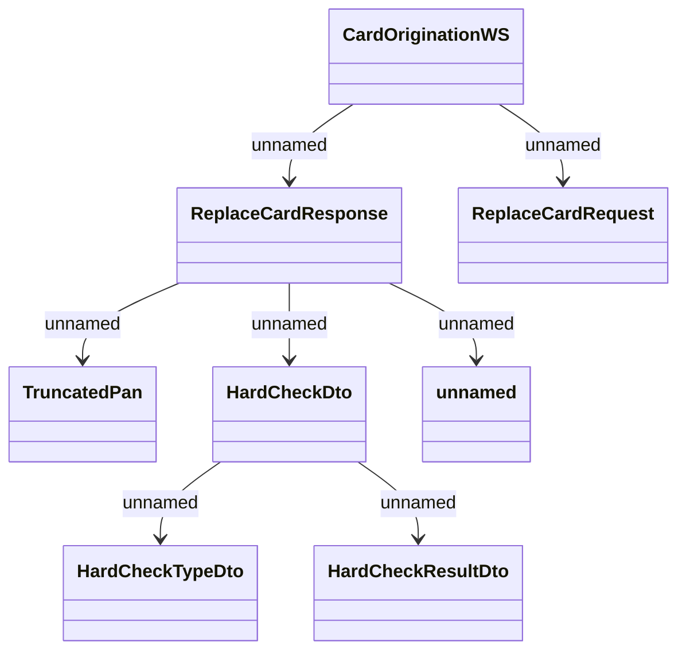

# CardOriginationWS.ReplaceCard

```mermaid
classDiagram
    class CardOriginationWS["CardOriginationWS"]
    class TruncatedPan["TruncatedPan"]
    class HardCheckResultDto["HardCheckResultDto"]
    class HardCheckTypeDto["HardCheckTypeDto"]
    class HardCheckDto["HardCheckDto"]
    class ReplaceCardResponse["ReplaceCardResponse"]
    class ReplaceCardRequest["ReplaceCardRequest"]
    CardOriginationWS --> ReplaceCardRequest : unnamed
    CardOriginationWS --> ReplaceCardResponse : unnamed
    ReplaceCardResponse --> unnamed : unnamed
    ReplaceCardResponse --> HardCheckDto : unnamed
    HardCheckDto --> HardCheckTypeDto : unnamed
    HardCheckDto --> HardCheckResultDto : unnamed
    ReplaceCardResponse --> TruncatedPan : unnamed
```
