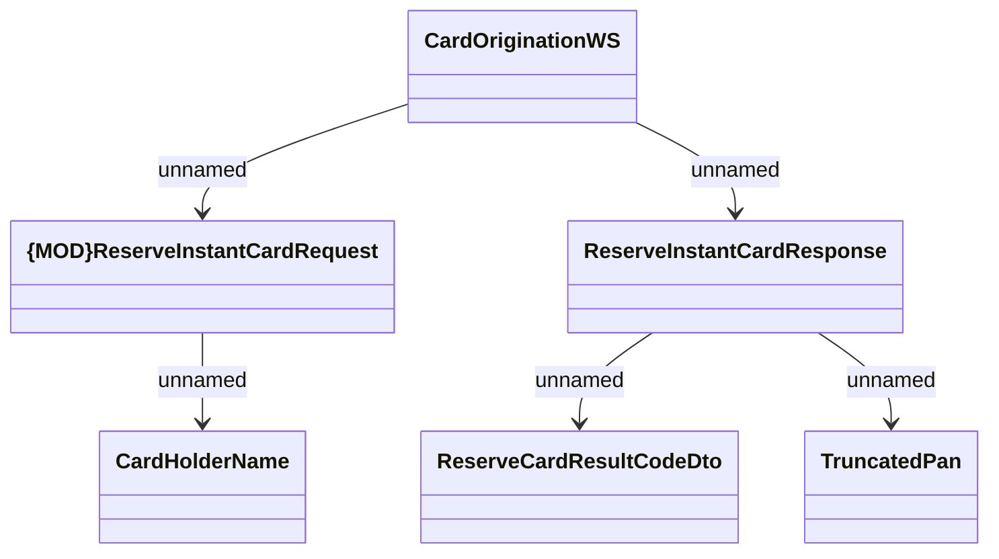

# CardOriginationWS.ReserveInstantCard

```mermaid
classDiagram
    class CardHolderName["CardHolderName"]
    class TruncatedPan["TruncatedPan"]
    class ReserveCardResultCodeDto["ReserveCardResultCodeDto"]
    class ReserveInstantCardResponse["ReserveInstantCardResponse"]
    class MOD_ReserveInstantCardRequest["{MOD}ReserveInstantCardRequest"]
    class CardOriginationWS["CardOriginationWS"]
    CardOriginationWS --> MOD_ReserveInstantCardRequest : unnamed
    CardOriginationWS --> ReserveInstantCardResponse : unnamed
    ReserveInstantCardResponse --> ReserveCardResultCodeDto : unnamed
    ReserveInstantCardResponse --> TruncatedPan : unnamed
    MOD_ReserveInstantCardRequest --> CardHolderName : unnamed
```
