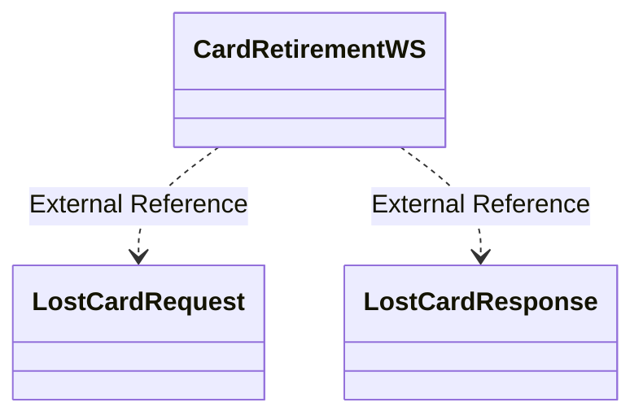

# CardRetirementWS.LostCard

- **Diagram Type**: Logical
- **Package**: HomerSelect/BSL/Analysis Model/_Interface/Consumed services/Card Management System/CardRetirementWS
- **Diagram ID**: 95748
- **Elements**: 3
- **Connectors**: 2

