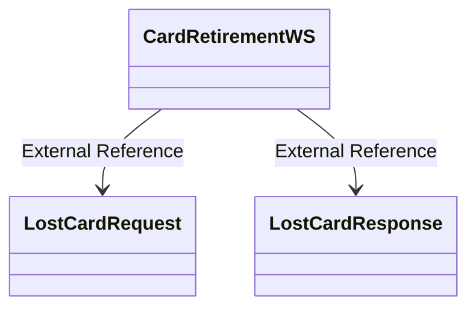

# CardRetirementWS.LostCard

```mermaid
classDiagram
    class LostCardResponse["LostCardResponse"]
    class LostCardRequest["LostCardRequest"]
    class CardRetirementWS["CardRetirementWS"]
    CardRetirementWS --> LostCardRequest : External Reference
    CardRetirementWS --> LostCardResponse : External Reference
```
