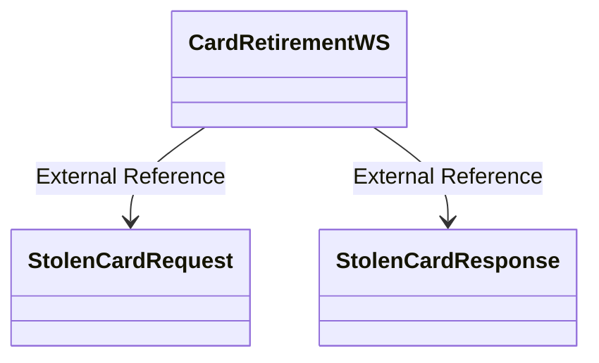

# CardRetirementWS.StolenCard

```mermaid
classDiagram
    class CardRetirementWS["CardRetirementWS"]
    class StolenCardResponse["StolenCardResponse"]
    class StolenCardRequest["StolenCardRequest"]
    CardRetirementWS --> StolenCardRequest : External Reference
    CardRetirementWS --> StolenCardResponse : External Reference
```
