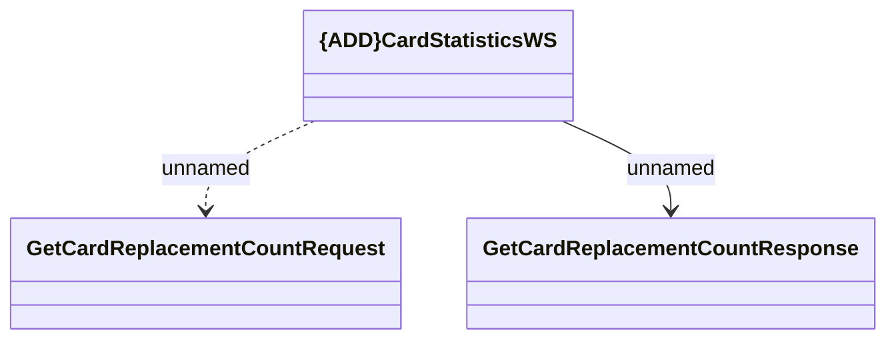

# CardStatisticsWS.GetCardReplacementCountRequest

- **Diagram Type**: Logical
- **Package**: HomerSelect/BSL/Analysis Model/_Interface/Consumed services/Card Management System/CardStatisticsWS
- **Diagram ID**: 121662
- **Elements**: 3
- **Connectors**: 2

