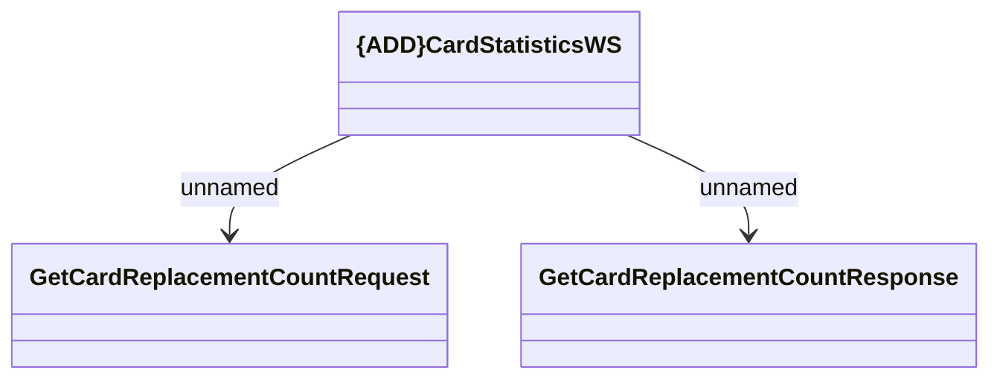

# CardStatisticsWS.GetCardReplacementCountRequest

```mermaid
classDiagram
    class GetCardReplacementCountResponse["GetCardReplacementCountResponse"]
    class GetCardReplacementCountRequest["GetCardReplacementCountRequest"]
    class ADD_CardStatisticsWS["{ADD}CardStatisticsWS"]
    ADD_CardStatisticsWS --> GetCardReplacementCountRequest : unnamed
    ADD_CardStatisticsWS --> GetCardReplacementCountResponse : unnamed
```
