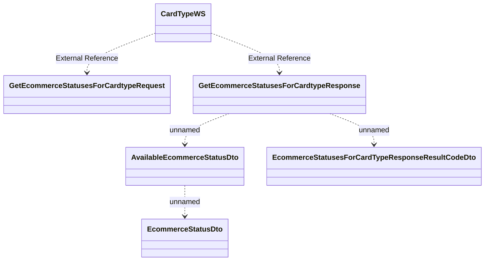

# CardTypeWS.GetEcommerceStatusesForCardtype

- **Diagram Type**: Logical
- **Package**: HomerSelect/BSL/Analysis Model/_Interface/Consumed services/Card Management System/CardTypeWS
- **Diagram ID**: 95750
- **Elements**: 6
- **Connectors**: 5

