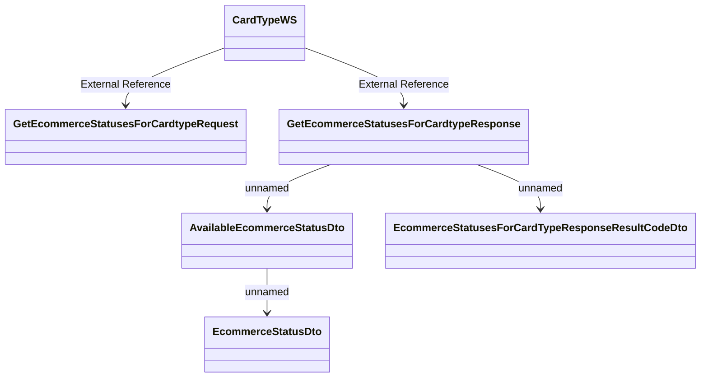

# CardTypeWS.GetEcommerceStatusesForCardtype

```mermaid
classDiagram
    class EcommerceStatusDto["EcommerceStatusDto"]
    class AvailableEcommerceStatusDto["AvailableEcommerceStatusDto"]
    class EcommerceStatusesForCardTypeResponseResultCodeDto["EcommerceStatusesForCardTypeResponseResultCodeDto"]
    class GetEcommerceStatusesForCardtypeRequest["GetEcommerceStatusesForCardtypeRequest"]
    class GetEcommerceStatusesForCardtypeResponse["GetEcommerceStatusesForCardtypeResponse"]
    class CardTypeWS["CardTypeWS"]
    CardTypeWS --> GetEcommerceStatusesForCardtypeResponse : External Reference
    CardTypeWS --> GetEcommerceStatusesForCardtypeRequest : External Reference
    GetEcommerceStatusesForCardtypeResponse --> AvailableEcommerceStatusDto : unnamed
    GetEcommerceStatusesForCardtypeResponse --> EcommerceStatusesForCardTypeResponseResultCodeDto : unnamed
    AvailableEcommerceStatusDto --> EcommerceStatusDto : unnamed
```
