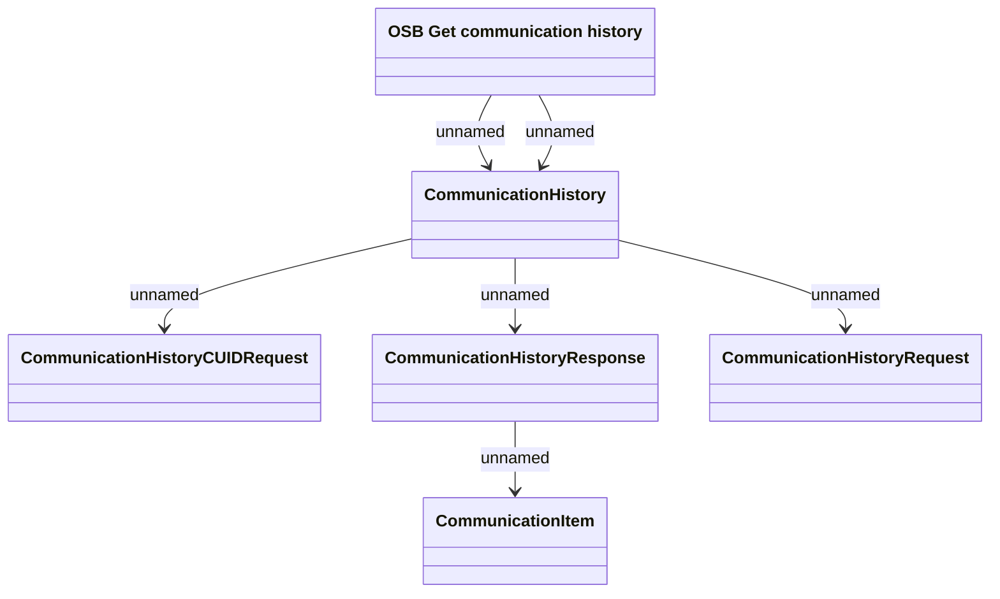

# LCS Interfaces - communication history

```mermaid
classDiagram
    class OSB_Get_communication_history["OSB Get communication history"]
    class CommunicationHistoryCUIDRequest["CommunicationHistoryCUIDRequest"]
    class CommunicationItem["CommunicationItem"]
    class CommunicationHistoryResponse["CommunicationHistoryResponse"]
    class CommunicationHistoryRequest["CommunicationHistoryRequest"]
    class CommunicationHistory["CommunicationHistory"]
    CommunicationHistory --> CommunicationHistoryRequest : unnamed
    CommunicationHistory --> CommunicationHistoryResponse : unnamed
    CommunicationHistoryResponse --> CommunicationItem : unnamed
    CommunicationHistory --> CommunicationHistoryCUIDRequest : unnamed
    OSB_Get_communication_history --> CommunicationHistory : unnamed
    OSB_Get_communication_history --> CommunicationHistory : unnamed
```
