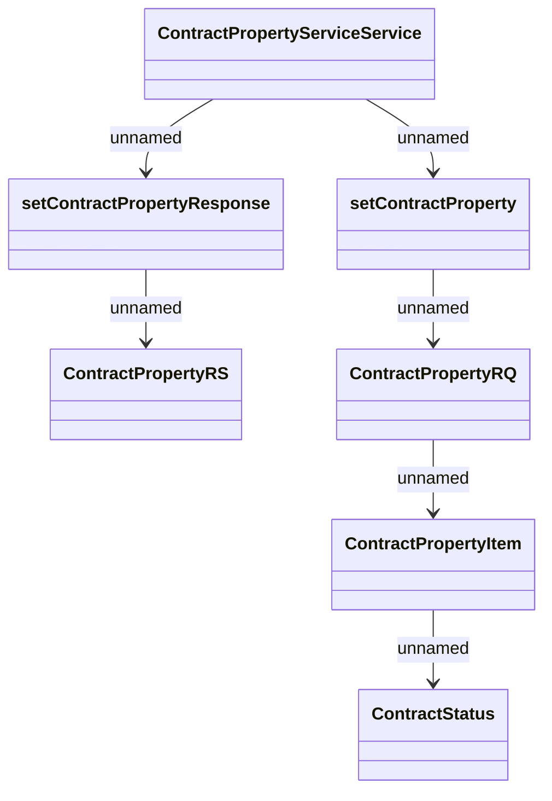

# LCS interface - Contract Property Service

```mermaid
classDiagram
    class setContractPropertyResponse["setContractPropertyResponse"]
    class setContractProperty["setContractProperty"]
    class ContractStatus["ContractStatus"]
    class ContractPropertyRS["ContractPropertyRS"]
    class ContractPropertyRQ["ContractPropertyRQ"]
    class ContractPropertyItem["ContractPropertyItem"]
    class ContractPropertyServiceService["ContractPropertyServiceService"]
    ContractPropertyRQ --> ContractPropertyItem : unnamed
    setContractProperty --> ContractPropertyRQ : unnamed
    setContractPropertyResponse --> ContractPropertyRS : unnamed
    ContractPropertyItem --> ContractStatus : unnamed
    ContractPropertyServiceService --> setContractProperty : unnamed
    ContractPropertyServiceService --> setContractPropertyResponse : unnamed
```
