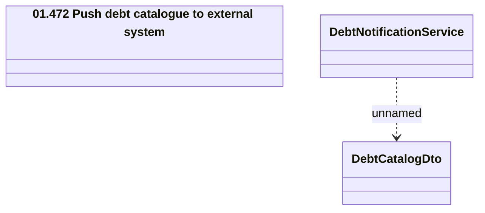

# LCS interface - DebtNotificationService

- **Diagram Type**: Logical
- **Package**: HomerSelect/BSL/Analysis Model/_Interface/Consumed services/Collections system interfaces
- **Diagram ID**: 97674
- **Elements**: 3
- **Connectors**: 1

