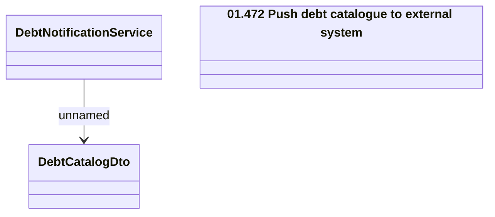

# LCS interface - DebtNotificationService

```mermaid
classDiagram
    class DebtNotificationService["DebtNotificationService"]
    class DebtCatalogDto["DebtCatalogDto"]
    class n_01_472_Push_debt_catalogue_to_external_system["01.472 Push debt catalogue to external system"]
    DebtNotificationService --> DebtCatalogDto : unnamed
```
