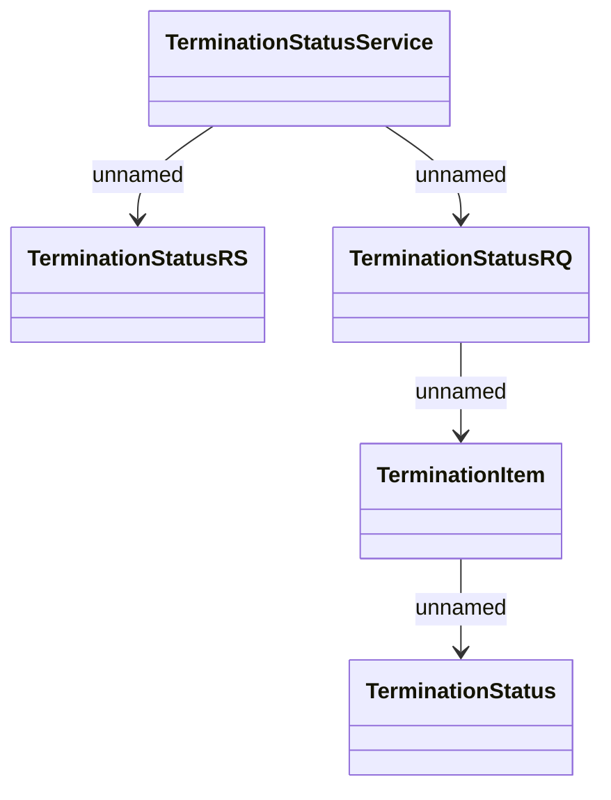

# LCS interface - TerminationStatusService

```mermaid
classDiagram
    class TerminationStatusRS["TerminationStatusRS"]
    class TerminationStatusRQ["TerminationStatusRQ"]
    class TerminationStatusService["TerminationStatusService"]
    class TerminationStatus["TerminationStatus"]
    class TerminationItem["TerminationItem"]
    TerminationStatusService --> TerminationStatusRS : unnamed
    TerminationStatusService --> TerminationStatusRQ : unnamed
    TerminationStatusRQ --> TerminationItem : unnamed
    TerminationItem --> TerminationStatus : unnamed
```
