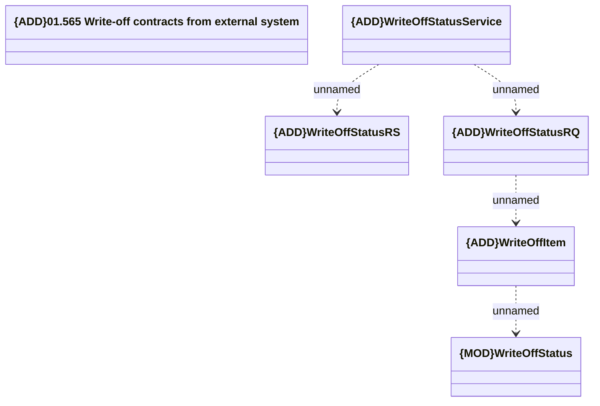

# LCS interface - WriteOffStatusService

- **Diagram Type**: Logical
- **Package**: HomerSelect/BSL/Analysis Model/_Interface/Consumed services/Collections system interfaces
- **Diagram ID**: 97676
- **Elements**: 6
- **Connectors**: 4

