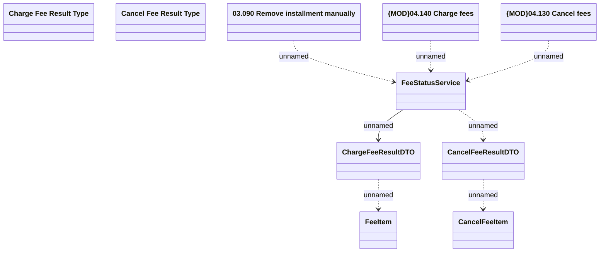

# LCS interfaces - FeeStatusService

- **Diagram Type**: Logical
- **Package**: HomerSelect/BSL/Analysis Model/_Interface/Consumed services/Collections system interfaces
- **Diagram ID**: 97670
- **Elements**: 10
- **Connectors**: 7

