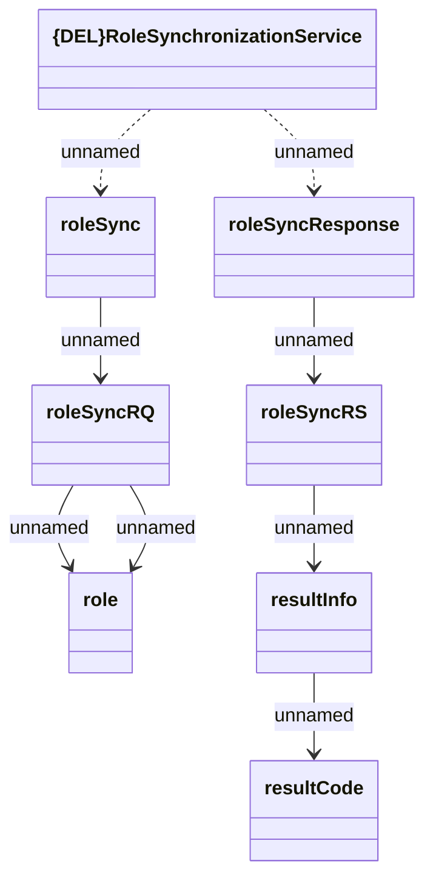

# {DEL}LCS Interface - role synchronization service

- **Diagram Type**: Logical
- **Package**: HomerSelect/BSL/Analysis Model/_Interface/Consumed services/Collections system interfaces
- **Diagram ID**: 97672
- **Elements**: 8
- **Connectors**: 8

