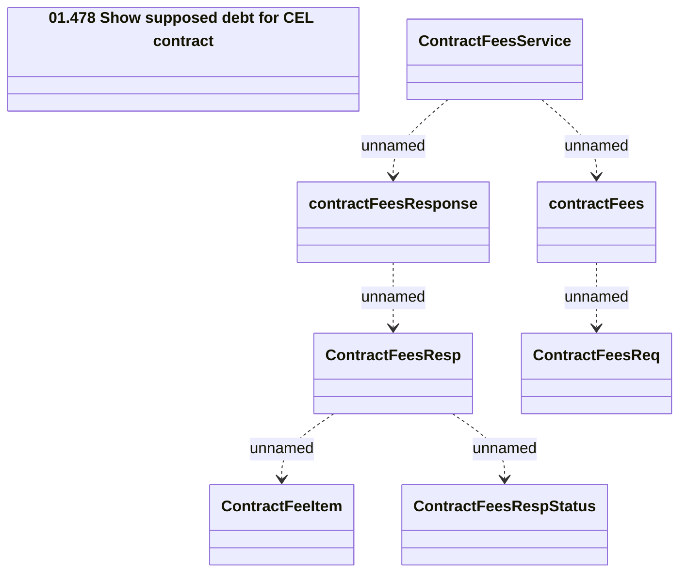

# Contract Fees Service

- **Diagram Type**: Logical
- **Package**: HomerSelect/BSL/Analysis Model/_Interface/Consumed services/Collections system interfaces/Contract Fees Service
- **Diagram ID**: 63976
- **Elements**: 8
- **Connectors**: 6

