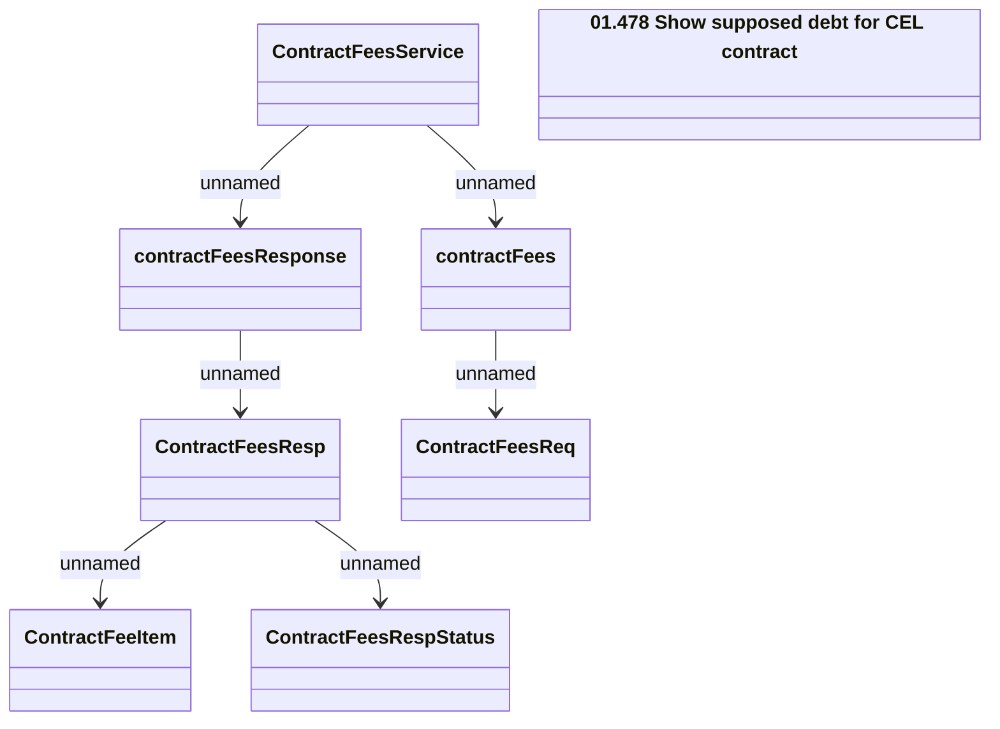

# Contract Fees Service

```mermaid
classDiagram
    class ContractFeesRespStatus["ContractFeesRespStatus"]
    class ContractFeeItem["ContractFeeItem"]
    class ContractFeesResp["ContractFeesResp"]
    class ContractFeesReq["ContractFeesReq"]
    class contractFeesResponse["contractFeesResponse"]
    class contractFees["contractFees"]
    class ContractFeesService["ContractFeesService"]
    class n_01_478_Show_supposed_debt_for_CEL_contract["01.478 Show supposed debt for CEL contract"]
    ContractFeesService --> contractFees : unnamed
    ContractFeesService --> contractFeesResponse : unnamed
    contractFees --> ContractFeesReq : unnamed
    contractFeesResponse --> ContractFeesResp : unnamed
    ContractFeesResp --> ContractFeeItem : unnamed
    ContractFeesResp --> ContractFeesRespStatus : unnamed
```
