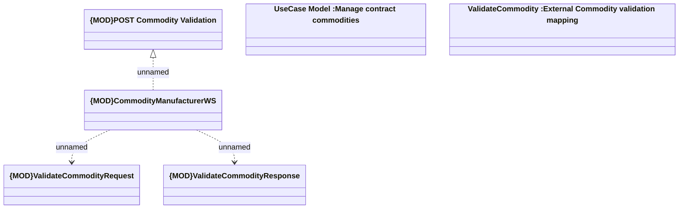

# Commodity External Validation

- **Diagram Type**: Logical
- **Package**: HomerSelect/BSL/Analysis Model/_Interface/Consumed services/CommodityManufacturerWS
- **Diagram ID**: 163984
- **Elements**: 6
- **Connectors**: 3

