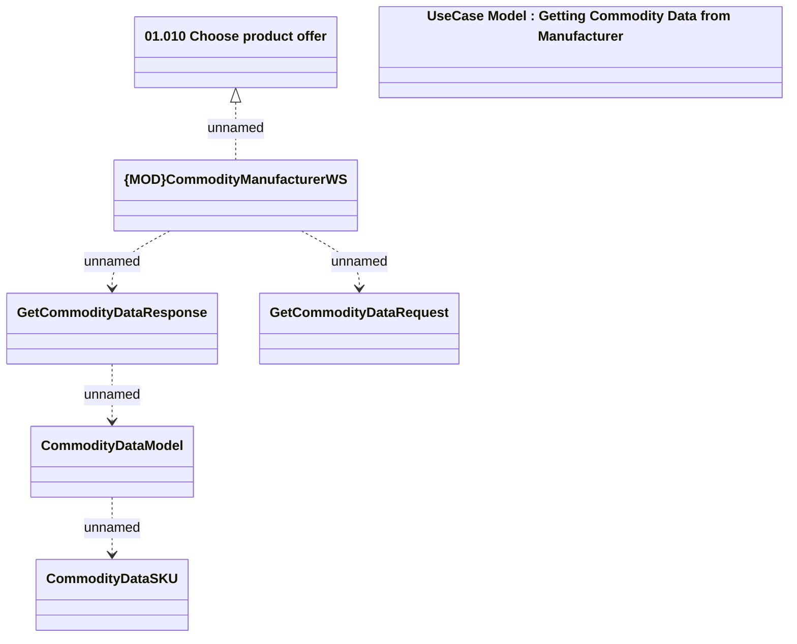

# Getting Commodity Data from Manufacturer

- **Diagram Type**: Logical
- **Package**: HomerSelect/BSL/Analysis Model/_Interface/Consumed services/CommodityManufacturerWS
- **Diagram ID**: 163985
- **Elements**: 7
- **Connectors**: 5

