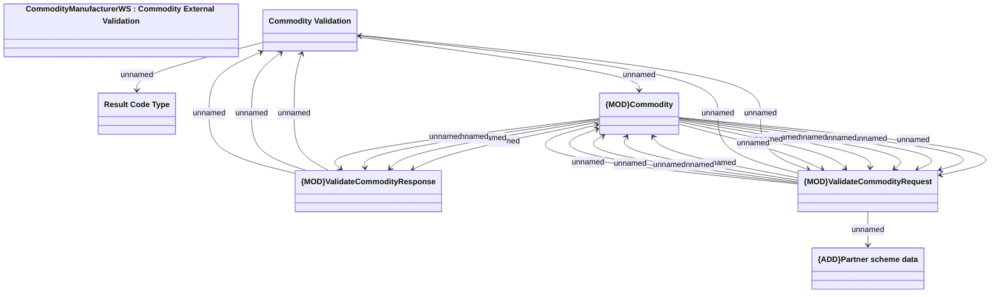

# External Commodity validation mapping

```mermaid
classDiagram
    class ADD_Partner_scheme_data["{ADD}Partner scheme data"]
    class Result_Code_Type["Result Code Type"]
    class CommodityManufacturerWS_Commodity_External_Validation["CommodityManufacturerWS : Commodity External Validation"]
    class Commodity_Validation["Commodity Validation"]
    class MOD_ValidateCommodityResponse["{MOD}ValidateCommodityResponse"]
    class MOD_ValidateCommodityRequest["{MOD}ValidateCommodityRequest"]
    class MOD_Commodity["{MOD}Commodity"]
    MOD_ValidateCommodityResponse --> Commodity_Validation : unnamed
    MOD_ValidateCommodityRequest --> Commodity_Validation : unnamed
    MOD_ValidateCommodityResponse --> Commodity_Validation : unnamed
    MOD_ValidateCommodityResponse --> Commodity_Validation : unnamed
    MOD_ValidateCommodityRequest --> ADD_Partner_scheme_data : unnamed
    MOD_ValidateCommodityRequest --> MOD_Commodity : unnamed
    MOD_ValidateCommodityRequest --> MOD_Commodity : unnamed
    MOD_ValidateCommodityRequest --> MOD_Commodity : unnamed
    MOD_ValidateCommodityRequest --> MOD_Commodity : unnamed
    MOD_ValidateCommodityRequest --> MOD_Commodity : unnamed
    MOD_Commodity --> MOD_ValidateCommodityResponse : unnamed
    MOD_Commodity --> MOD_ValidateCommodityRequest : unnamed
    MOD_Commodity --> MOD_ValidateCommodityRequest : unnamed
    MOD_Commodity --> MOD_ValidateCommodityRequest : unnamed
    MOD_Commodity --> MOD_ValidateCommodityResponse : unnamed
    MOD_Commodity --> MOD_ValidateCommodityResponse : unnamed
    Commodity_Validation --> MOD_Commodity : unnamed
    MOD_Commodity --> MOD_ValidateCommodityRequest : unnamed
    MOD_Commodity --> MOD_ValidateCommodityRequest : unnamed
    MOD_Commodity --> MOD_ValidateCommodityResponse : unnamed
    MOD_Commodity --> MOD_ValidateCommodityRequest : unnamed
    MOD_Commodity --> MOD_ValidateCommodityRequest : unnamed
    Commodity_Validation --> Result_Code_Type : unnamed
    Commodity_Validation --> MOD_ValidateCommodityRequest : unnamed
```
