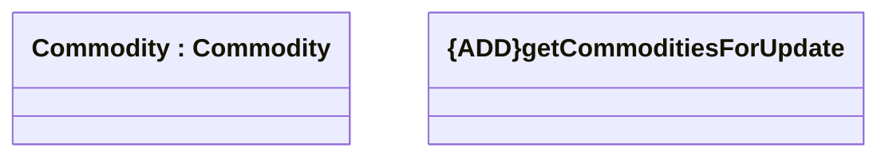

# Get commodities for update

- **Diagram Type**: Logical
- **Package**: HomerSelect/BSL/Analysis Model/_Interface/Consumed services/Commodity/v1.0/Get commodities for update
- **Diagram ID**: 136695
- **Elements**: 2
- **Connectors**: 0

