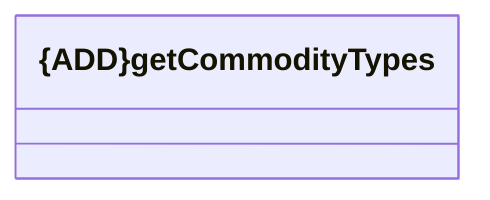

# Get commodity type

- **Diagram Type**: Logical
- **Package**: HomerSelect/BSL/Analysis Model/_Interface/Consumed services/Commodity/v1.0/Get commodity type
- **Diagram ID**: 136696
- **Elements**: 1
- **Connectors**: 0

