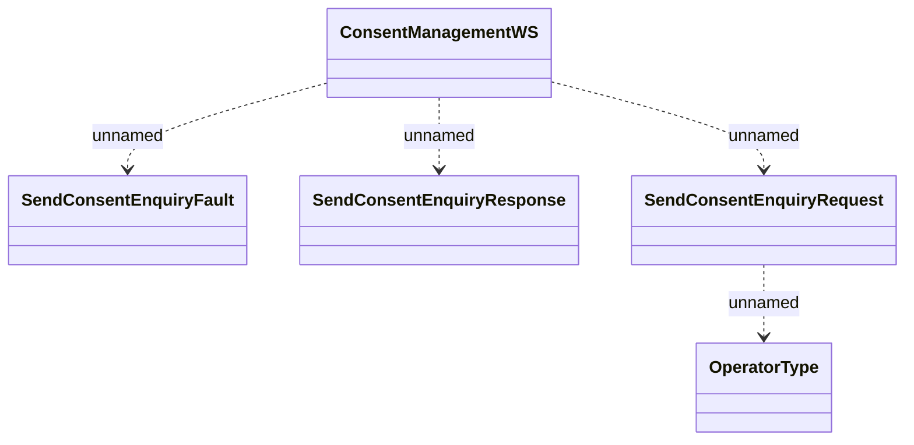

# ConsentManagementWS

- **Diagram Type**: Logical
- **Package**: HomerSelect/BSL/Analysis Model/_Interface/Consumed services/ConsentManagementWS/ConsentManagementWS
- **Diagram ID**: 111823
- **Elements**: 5
- **Connectors**: 4

