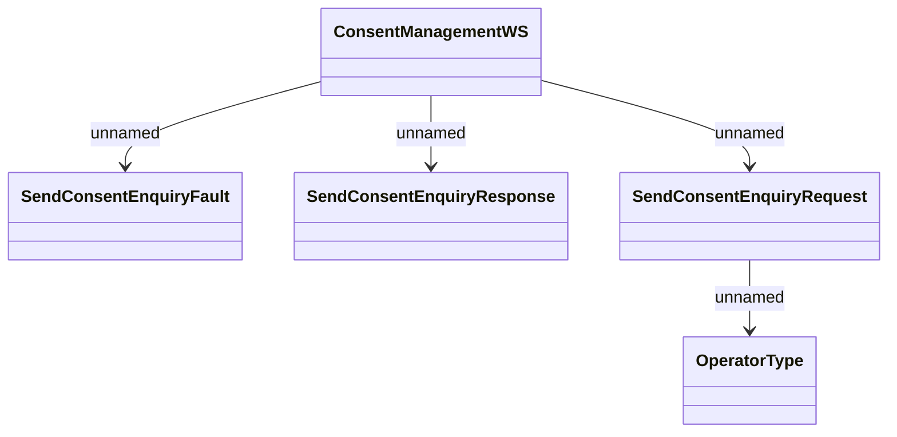

# ConsentManagementWS

```mermaid
classDiagram
    class SendConsentEnquiryFault["SendConsentEnquiryFault"]
    class OperatorType["OperatorType"]
    class SendConsentEnquiryResponse["SendConsentEnquiryResponse"]
    class SendConsentEnquiryRequest["SendConsentEnquiryRequest"]
    class ConsentManagementWS["ConsentManagementWS"]
    ConsentManagementWS --> SendConsentEnquiryRequest : unnamed
    ConsentManagementWS --> SendConsentEnquiryResponse : unnamed
    SendConsentEnquiryRequest --> OperatorType : unnamed
    ConsentManagementWS --> SendConsentEnquiryFault : unnamed
```
