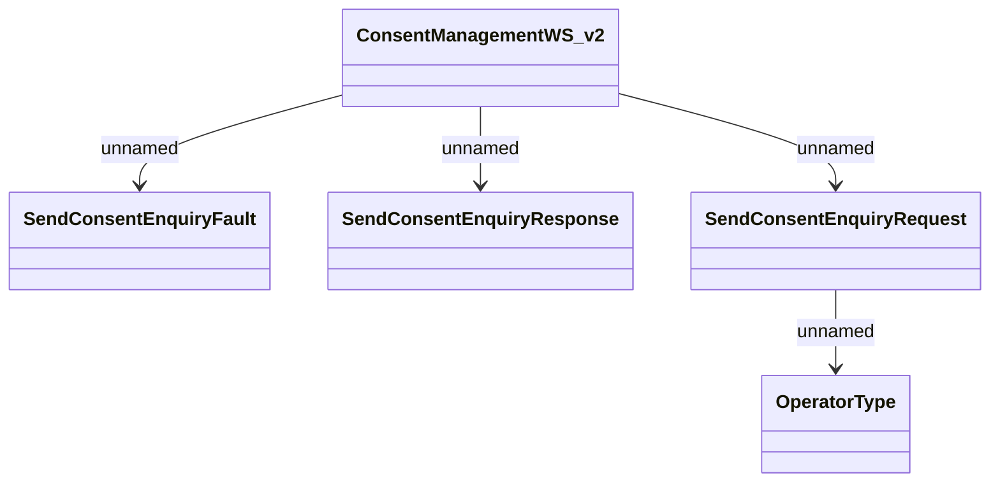

# ConsentManagementWS

```mermaid
classDiagram
    class SendConsentEnquiryFault["SendConsentEnquiryFault"]
    class OperatorType["OperatorType"]
    class SendConsentEnquiryResponse["SendConsentEnquiryResponse"]
    class SendConsentEnquiryRequest["SendConsentEnquiryRequest"]
    class ConsentManagementWS_v2["ConsentManagementWS_v2"]
    ConsentManagementWS_v2 --> SendConsentEnquiryRequest : unnamed
    ConsentManagementWS_v2 --> SendConsentEnquiryResponse : unnamed
    SendConsentEnquiryRequest --> OperatorType : unnamed
    ConsentManagementWS_v2 --> SendConsentEnquiryFault : unnamed
```
