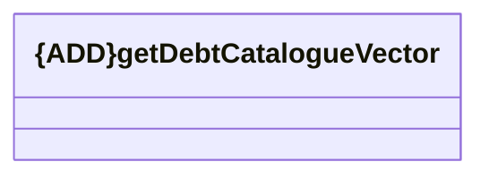

# getDebtCatalogueVector

- **Diagram Type**: Logical
- **Package**: HomerSelect/BSL/Analysis Model/_Interface/Consumed services/Debt catalogue/v1.0/getDebtCatalogueVector
- **Diagram ID**: 138775
- **Elements**: 1
- **Connectors**: 0

