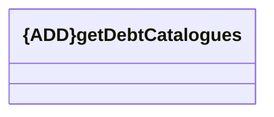

# getDebtCatalogues

- **Diagram Type**: Logical
- **Package**: HomerSelect/BSL/Analysis Model/_Interface/Consumed services/Debt catalogue/v1.0/getDebtCatalogues
- **Diagram ID**: 138774
- **Elements**: 1
- **Connectors**: 0

