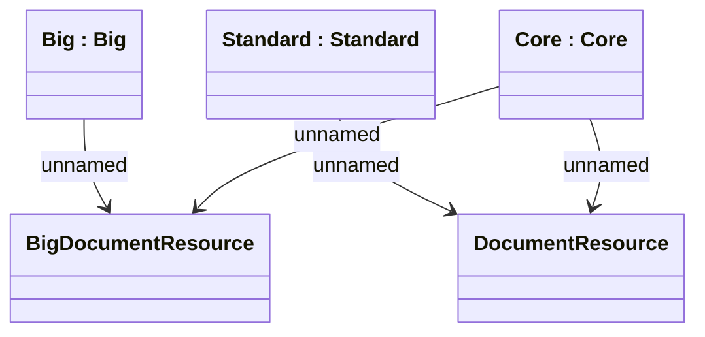

# DMS - Cabinet

- **Diagram Type**: Logical
- **Package**: HomerSelect/BSL/Analysis Model/_Interface/Consumed services/Document Management System
- **Diagram ID**: 147347
- **Elements**: 5
- **Connectors**: 4

