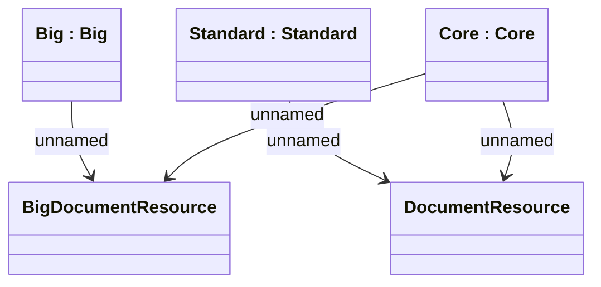

# DMS - Cabinet

```mermaid
classDiagram
    class Big_Big["Big : Big"]
    class Standard_Standard["Standard : Standard"]
    class Core_Core["Core : Core"]
    class BigDocumentResource["BigDocumentResource"]
    class DocumentResource["DocumentResource"]
    Standard_Standard --> DocumentResource : unnamed
    Core_Core --> DocumentResource : unnamed
    Big_Big --> BigDocumentResource : unnamed
    Core_Core --> BigDocumentResource : unnamed
```
